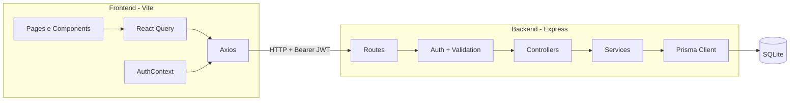
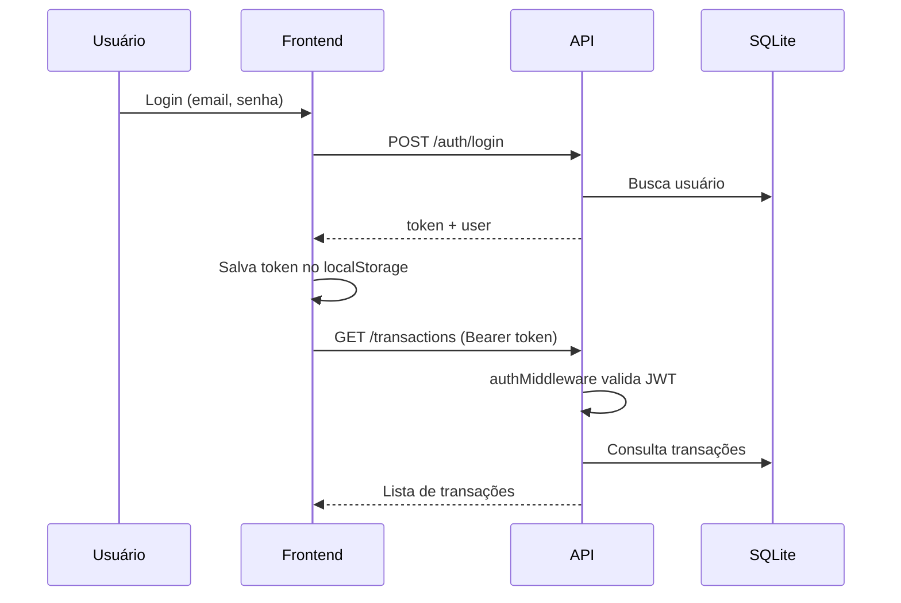

# FinancialTracker

Aplicação **full-stack** de controle financeiro pessoal: cadastre receitas e despesas, acompanhe saldo em tempo real, visualize gráficos e gerencie transações com autenticação JWT.

Projeto pensado para portfólio, com arquitetura em camadas, validação com Zod e interface moderna e responsiva.

---

## Funcionalidades

| Área | Descrição |
|------|-----------|
| **Autenticação** | Registro, login com JWT, rotas protegidas e logout |
| **Dashboard** | Saldo, receitas, despesas, últimas transações e gráficos |
| **Transações** | CRUD completo (criar, listar, editar, excluir) |
| **Filtros** | Busca por título, tipo (receita/despesa) e período |
| **Paginação** | Paginação no frontend (lista completa vinda da API) |
| **UX** | Toasts, skeletons, empty states e confirmação de exclusão |
| **Gráficos** | Evolução mensal, despesas por título e saldo acumulado |

---

## Stack tecnológica

### Backend (`/backend`)

- **Node.js** + **Express 5**
- **Prisma ORM** + **SQLite**
- **JWT** (jsonwebtoken) + **bcrypt**
- **Zod** (validação de entrada)
- **CORS**

### Frontend (`/finantial-tracker-client`)

- **React 19** + **TypeScript**
- **Vite 8**
- **Tailwind CSS 4** + **shadcn/ui**
- **React Router DOM**
- **Axios**
- **TanStack Query**
- **React Hook Form** + **Zod**
- **Sonner** (notificações)
- **Recharts** (gráficos)

---

## Arquitetura



---

## Estrutura do repositório

```
FinancialTracker/
├── backend/
│   ├── prisma/
│   │   ├── schema.prisma      # Modelos User e Transaction
│   │   └── migrations/
│   └── src/
│       ├── controller/
│       ├── middlewares/
│       ├── routes/
│       ├── schemas/
│       ├── service/
│       ├── utils/
│       ├── app.js
│       └── server.js
│
├── finantial-tracker-client/
│   └── src/
│       ├── components/        # UI, layout, dashboard, transações
│       ├── pages/
│       ├── layouts/
│       ├── routes/
│       ├── services/
│       ├── hooks/
│       ├── contexts/
│       ├── schemas/
│       ├── types/
│       ├── lib/
│       ├── App.tsx
│       └── main.tsx
│
└── README.md
```

---

## Pré-requisitos

- **Node.js** 20 ou superior
- **npm** 10+

---

## Configuração e execução local

### 1. Clone o repositório

```bash
git clone https://github.com/<seu-usuario>/FinancialTracker.git
cd FinancialTracker
```

### 2. Backend

```bash
cd backend
npm install
```

Crie o arquivo `.env` na pasta `backend/`:

```env
DATABASE_URL="file:./prisma/dev.db"
JWT_SECRET="sua-chave-secreta-forte-aqui"
PORT=3000
```

Aplique as migrations e gere o client Prisma:

```bash
npx prisma migrate dev
npx prisma generate
```

Inicie o servidor:

```bash
npm run dev
```

A API ficará disponível em **http://localhost:3000**.

### 3. Frontend

Em outro terminal:

```bash
cd finantial-tracker-client
npm install
cp .env.example .env
```

Conteúdo do `.env`:

```env
VITE_API_URL=http://localhost:3000
```

Inicie o app:

```bash
npm run dev
```

A interface abrirá em **http://localhost:5173** (porta padrão do Vite).

---

## Variáveis de ambiente

### Backend (`backend/.env`)

| Variável | Obrigatória | Descrição |
|----------|-------------|-----------|
| `DATABASE_URL` | Sim | URL do SQLite (ex.: `file:./prisma/dev.db`) |
| `JWT_SECRET` | Sim | Chave para assinar tokens JWT |
| `PORT` | Não | Porta do servidor (padrão: `3000`) |

### Frontend (`finantial-tracker-client/.env`)

| Variável | Obrigatória | Descrição |
|----------|-------------|-----------|
| `VITE_API_URL` | Não | URL da API (padrão: `http://localhost:3000`) |

---

## API REST

Base URL: `http://localhost:3000`

Rotas protegidas exigem o header:

```
Authorization: Bearer <token>
```

### Autenticação

| Método | Rota | Auth | Body | Resposta |
|--------|------|------|------|----------|
| `POST` | `/auth/register` | Não | `{ name, email, password }` | `201` — usuário criado |
| `POST` | `/auth/login` | Não | `{ email, password }` | `200` — `{ token, user }` |

**Exemplo de login (sucesso):**

```json
{
  "token": "eyJhbGciOiJIUzI1NiIs...",
  "user": {
    "id": "uuid",
    "name": "Guilherme",
    "email": "voce@email.com"
  }
}
```

**Validação (registro/login):**

- `name`: mínimo 3 caracteres (apenas registro)
- `email`: formato válido
- `password`: mínimo 6 caracteres (login) / 8 no serviço de criação de usuário

**Erros comuns (login):**

| Mensagem | Significado |
|----------|-------------|
| `ACCOUNT_NOT_FOUND` | E-mail não cadastrado |
| `INCORRECT_PASSWORD` | Senha incorreta |
| `USER_ALREADY_EXISTS` | E-mail já usado (registro) |

### Usuário

| Método | Rota | Auth | Resposta |
|--------|------|------|----------|
| `GET` | `/users/profile` | Sim | `{ message, userId }` |

### Transações

| Método | Rota | Auth | Body / Params | Resposta |
|--------|------|------|---------------|----------|
| `GET` | `/transactions` | Sim | — | Lista de transações do usuário |
| `GET` | `/transactions/summary` | Sim | — | `{ income, expense, balance }` |
| `POST` | `/transactions` | Sim | `{ title, amount, type }` | `201` — transação criada |
| `PUT` | `/transactions/:id` | Sim | `{ title?, amount?, type? }` | `200` — transação atualizada |
| `DELETE` | `/transactions/:id` | Sim | — | `204` — sem corpo |

**`type`:** `"income"` (receita) ou `"expense"` (despesa)

**Modelo de transação:**

```json
{
  "id": "uuid",
  "title": "Salário",
  "amount": 5000,
  "type": "income",
  "createdAt": "2026-05-27T12:00:00.000Z",
  "userId": "uuid"
}
```

**Resumo financeiro:**

```json
{
  "income": 5000,
  "expense": 1200,
  "balance": 3800
}
```

---

## Rotas do frontend

| Rota | Acesso | Descrição |
|------|--------|-----------|
| `/login` | Público | Login |
| `/register` | Público | Cadastro |
| `/dashboard` | Protegido | Resumo e gráficos |
| `/transactions` | Protegido | Lista e CRUD de transações |
| `/` | — | Redireciona para `/dashboard` |

O token JWT é armazenado em `localStorage` (`financial-tracker:token`) e enviado automaticamente pelo interceptor do Axios.

---

## Banco de dados

O backend usa **SQLite** via Prisma.

**Modelos principais:**

- **User** — `id`, `name`, `email`, `password` (hash bcrypt), `createdAt`
- **Transaction** — `id`, `title`, `amount`, `type` (`income` | `expense`), `userId`, `createdAt`

**Comandos úteis:**

```bash
cd backend

# Abrir Prisma Studio (interface visual)
npx prisma studio

# Reset do banco (cuidado: apaga dados)
npx prisma migrate reset
```

---

## Scripts disponíveis

### Backend

| Comando | Descrição |
|---------|-----------|
| `npm run dev` | Servidor com hot reload (`node --watch`) |

### Frontend

| Comando | Descrição |
|---------|-----------|
| `npm run dev` | Servidor de desenvolvimento |
| `npm run build` | Build de produção |
| `npm run preview` | Preview do build |
| `npm run lint` | ESLint |

---

## Deploy

### Frontend (Vercel)

1. Conecte o repositório na [Vercel](https://vercel.com)
2. **Root Directory:** `finantial-tracker-client`
3. **Build Command:** `npm run build`
4. **Output Directory:** `dist`
5. Variável de ambiente: `VITE_API_URL` → URL pública do backend

O arquivo `finantial-tracker-client/vercel.json` já configura o fallback SPA para o React Router.

### Backend

O backend pode ser hospedado em serviços como **Railway**, **Render**, **Fly.io** ou VPS. Recomendações:

- Use banco persistente em produção (PostgreSQL em vez de SQLite, se necessário)
- Defina `JWT_SECRET` forte e único por ambiente
- Configure **CORS** para aceitar apenas o domínio do frontend
- Rode `npx prisma migrate deploy` no pipeline de deploy

---

## Fluxo de autenticação



---

## Decisões técnicas

- **Validação dupla:** Zod no backend (middleware) e no frontend (React Hook Form) para feedback rápido e segurança na API.
- **React Query:** cache de transações e resumo, com `invalidateQueries` após mutações.
- **Filtros e paginação no cliente:** a API retorna todas as transações do usuário; filtros e páginas são aplicados no frontend até existir suporte server-side.
- **JWT com expiração de 7 dias** (`expiresIn: "7d"`).

---

## Roadmap (sugestões)

- [ ] Paginação e filtros na API (`?page`, `?limit`, `?search`, `?type`)
- [ ] Endpoint de perfil retornando dados completos do usuário
- [ ] Refresh token
- [ ] Categorias de transação
- [ ] Testes automatizados (Vitest + Supertest)
- [ ] CI/CD (GitHub Actions)

---

## Licença

Este projeto está sob a licença [MIT](LICENSE).

---

## Autor

**GBarbosa** — projeto de portfólio para demonstrar desenvolvimento full-stack com React e Node.js.
